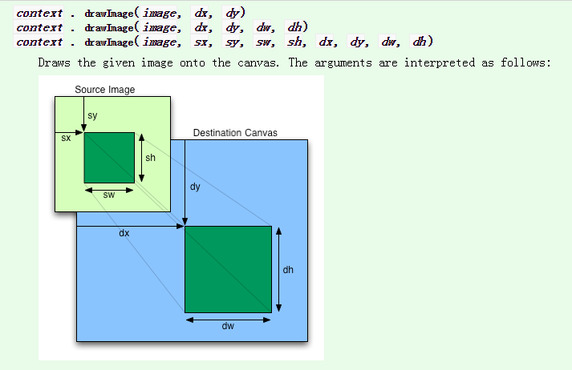

# Canvas-DrawImage
a demo about the usage of drawImage method

在用canvas的drawImage方法时,发现参数有点多，使用起来不是特别好理解，所以简单整理了下常见的几种用法


官方这么形容的：

To draw images onto the canvas, the drawImage method can be used.

This method can be invoked with three different sets of arguments:

-drawImage(image, dx, dy)
-drawImage(image, dx, dy, dw, dh)
-drawImage(image, sx, sy, sw, sh, dx, dy, dw, dh)

...

The source rectangle is the rectangle whose corners are the four points (sx, sy), (sx+sw, sy), (sx+sw, sy+sh), (sx, sy+sh).

...

The destination rectangle is the rectangle whose corners are the four points (dx, dy), (dx+dw, dy), (dx+dw, dy+dh), (dx, dy+dh).


还是不好理解，配上官方的这个图就很好理解了



```
drawImage() 方法在画布上绘制图像、画布或视频。
drawImage() 方法要图像完全载入后才能调用

dx和dy是image在canvas中定位的坐标值
dw和dh是image在canvas中即将绘制区域（相对dx和dy坐标的偏移量）的宽度和高度值
sx和sy是 开始剪切的 x,y 坐标位置
sw和sh是 被剪切图像的宽度,高度

dx, dy, dw, dh绘制图像, sx, sy, sw, sh用于裁剪
```

